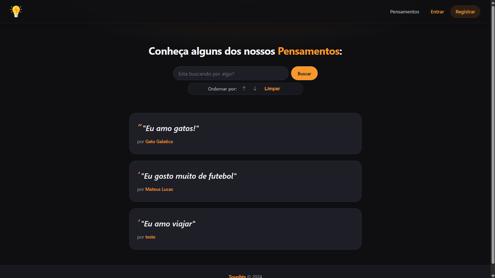
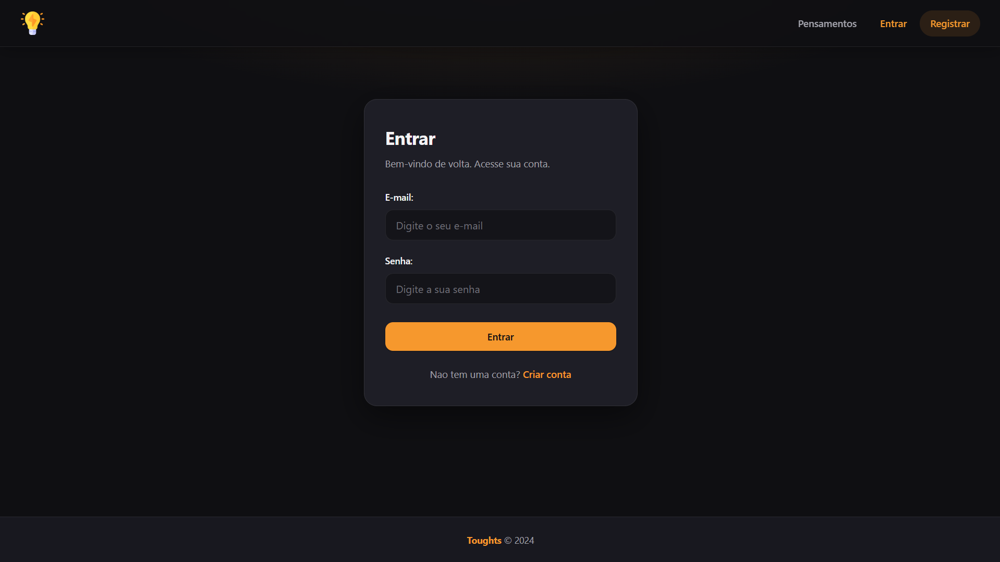
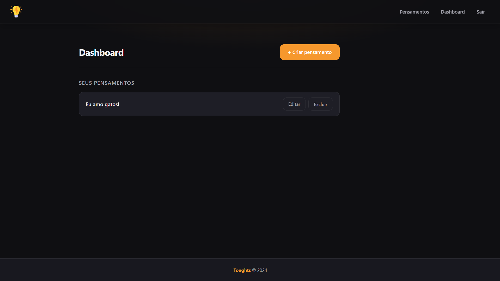
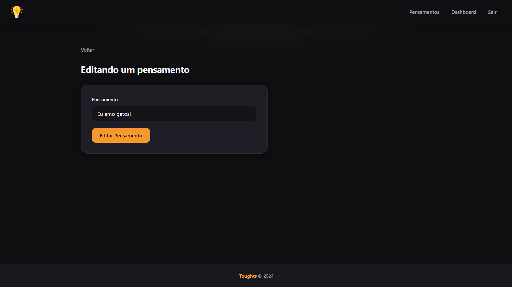

# Thoughts

**Thoughts** é uma aplicação web fullstack para registro, consulta e gestão de pensamentos curtos. O sistema permite que usuários autenticados publiquem conteúdo próprio e que visitantes explorem o acervo público com recursos de busca e ordenação. Este documento apresenta a visão do produto, a interface do usuário, a arquitetura do repositório e o procedimento de configuração e execução do ambiente de desenvolvimento.

---

## Visão geral

O **Thoughts** organiza o ciclo de vida de um pensamento em três etapas principais: **descoberta** (visualização pública na página inicial), **autenticação** (acesso seguro à conta) e **gestão** (criação, edição e exclusão no painel do usuário). A separação entre área pública e área autenticada garante que apenas o autor modifique seus registros, enquanto o feed global permanece acessível sem login.

| Camada      | Tecnologia | Responsabilidade                                      |
| ----------- | ---------- | ----------------------------------------------------- |
| Frontend    | React, Vite | Interface, navegação e consumo da API REST           |
| Backend     | Express    | Regras de negócio, persistência e autenticação       |
| Autenticação | Firebase  | Identidade de usuários e validação de sessão         |

---

## Interface do usuário

As telas abaixo ilustram o fluxo principal da aplicação. Cada imagem corresponde a uma rota do frontend e a um conjunto de operações descrito na seção.

### Home (`/`)

Página pública de descoberta. Exibe o feed de pensamentos de todos os usuários, com busca por termo e ordenação (mais recentes ou mais antigos). Não exige autenticação.



### Login (`/login`)

Tela de autenticação. O usuário informa e-mail e senha; após validação bem-sucedida, é redirecionado ao dashboard. Há enlace para cadastro de nova conta (`/register`).



### Dashboard (`/dashboard`)

Área restrita ao usuário autenticado. Lista apenas os pensamentos do titular da sessão, com ações de editar e excluir, além de atalho para criação de novo registro.



### Create (`/add`)

Formulário de criação de pensamento. Campo único para o conteúdo; ao submeter, o registro é persistido e o usuário retorna ao dashboard.


### Edit (`/edit/:id`)

Formulário de edição. Carrega o pensamento pelo identificador na URL, permite alterar o conteúdo e salvar as mudanças. Acesso restrito ao autor do registro.



### Rotas do frontend

| Rota            | Tela        | Autenticação |
| --------------- | ----------- | ------------ |
| `/`             | Home        | Não          |
| `/login`        | Login       | Não          |
| `/register`     | Cadastro    | Não          |
| `/dashboard`    | Dashboard   | Sim          |
| `/add`          | Create      | Sim          |
| `/edit/:id`     | Edit        | Sim          |

---

## Estrutura do repositório

```
toughts/
├── backend/          # API REST (Express)
├── frontend/         # Interface (React + Vite)
│   └── assets/       # Capturas de tela da documentação
└── README.md
```

---

## Backend

Acesse a pasta:

```bash
cd backend
```

Instale as dependências:

```bash
npm install
```

### Configuração (Firebase)

Antes de executar o backend, configure o Firebase como provedor de autenticação:

1. Acesse o [Firebase Console](https://console.firebase.google.com/)
2. Crie um novo projeto (ou utilize um existente)
3. Em **Settings** (Configurações do projeto)
4. Acesse **Service Accounts** (Contas de serviço)
5. Gere uma nova chave privada (arquivo JSON) e utilize os dados nas variáveis de ambiente

### Variáveis de ambiente

Crie um arquivo `.env` dentro de `backend`:

```env
FRONTEND_URL=http://localhost:5173
PORT=3000
FIREBASE_PROJECT_ID=your-project-id
FIREBASE_CLIENT_EMAIL=your-email
FIREBASE_PRIVATE_KEY=your-key
```

> **Nota:** `FRONTEND_URL` deve apontar para a origem em que o Vite executa o frontend (porta padrão `5173`), para que cookies e CORS funcionem corretamente em desenvolvimento.

### Executar o backend

```bash
npm run start
```

Servidor disponível em: http://localhost:3000

---

## Frontend

Acesse a pasta:

```bash
cd frontend
```

Instale as dependências:

```bash
npm install
```

### Variáveis de ambiente

Crie um `.env` em `frontend`:

```env
VITE_API_URL=http://localhost:3000/api/
```

### Executar o frontend

```bash
npm run dev
```

Aplicação disponível em: http://localhost:5173

### Uso recomendado em desenvolvimento

1. Inicie o **backend** (`npm run start` em `backend/`)
2. Inicie o **frontend** (`npm run dev` em `frontend/`)
3. Acesse http://localhost:5173 no navegador
4. Para fluxo completo: cadastre-se em `/register`, faça login e utilize o dashboard para criar e gerenciar pensamentos; a home exibirá o feed público após publicações

---

## Endpoints da API

Base URL em desenvolvimento: `http://localhost:3000/api`

| Método | Rota          | Descrição                              | Autenticação |
| ------ | ------------- | -------------------------------------- | ------------ |
| POST   | `/login`      | Autenticação do usuário                | Não          |
| POST   | `/register`   | Criação de usuário                     | Não          |
| POST   | `/logout`     | Encerramento de sessão                 | Não          |
| GET    | `/`           | Lista todos os pensamentos (feed)      | Não          |
| GET    | `/dashboard`  | Lista pensamentos do usuário logado    | Sim          |
| GET    | `/:id`        | Busca pensamento por ID                | Não          |
| POST   | `/`           | Cria um pensamento                     | Sim          |
| PUT    | `/:id`        | Atualiza um pensamento                 | Sim          |
| DELETE | `/:id`        | Remove um pensamento                   | Sim          |

Rotas marcadas como **Sim** em autenticação exigem sessão válida (cookie/token conforme implementação do backend).

---

## Observações

- O nome do projeto utiliza a grafia **Toughts** (variação intencional de *thoughts*).
- Em produção, configure `FRONTEND_URL`, `VITE_API_URL` e credenciais Firebase de acordo com os domínios reais da aplicação.
- As capturas em `frontend/assets/` refletem o estado visual atual da interface e podem ser atualizadas conforme o produto evoluir.
